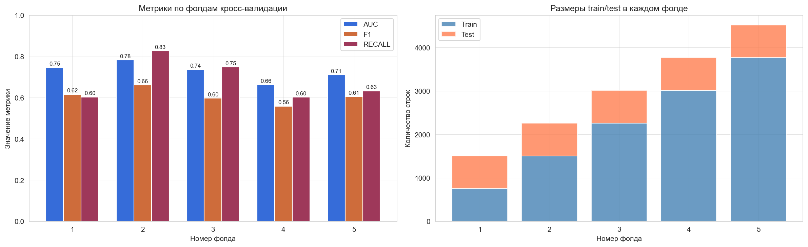
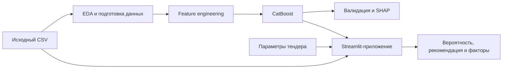
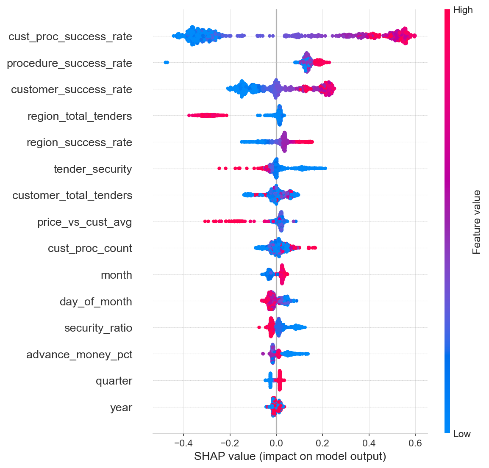

# Анализ тендерных закупок с помощью CatBoost

Учебный ML-проект и прототип информационной системы, выполненный в рамках ВКР «Информационная система анализа тендерных закупок на основе методов искусственного интеллекта».

Приложение оценивает вероятность того, что закупка успешно завершится, показывает рекомендацию по участию и объясняет прогноз с помощью SHAP. Целевая переменная `y_success` равна `1`, если поле `selection_phase` имеет значение `Завершена`, и `0` в остальных случаях.

> **Статус проекта:** исследовательский PoC/MVP. Результат модели — дополнительный сигнал для специалиста, а не автоматическое решение об участии в закупке.

## Что умеет прототип

- принимает основные параметры закупки: название, процедуру, законодательство, регион, ИНН заказчика, дату и финансовые условия;
- рассчитывает финансовые, временные и исторические признаки;
- получает вероятность успешного завершения закупки от `CatBoostClassifier`;
- переводит вероятность в один из трёх сценариев: «рекомендуется участвовать», «пограничный случай» или «высокий риск»;
- показывает пять признаков с наибольшим влиянием на конкретный прогноз;
- работает через локальный веб-интерфейс на Streamlit.

## Результаты модели

Модель обучалась на 4 519 закупках за 2017–2023 годы. Для проверки использовалось разделение по времени, чтобы модель обучалась на прошлом и оценивалась на более позднем периоде.

| Метрика | Отложенная выборка | TimeSeriesSplit, 5 фолдов |
|---|---:|---:|
| ROC-AUC | 0,710 | 0,728 ± 0,044 |
| F1-score | 0,600 | 0,608 ± 0,037 |
| Recall | 0,652 | — |

Метрики и результаты экспериментов находятся в [`models/`](models/) и [`reports/`](reports/).



## Как устроен проект



Финальная модель использует 28 признаков:

- финансовые — цена, обеспечение, аванс и производные отношения;
- временные — год, месяц, квартал и день публикации;
- категориальные — процедура, законодательство, регион и признак участия малого бизнеса;
- исторические — успешность и количество прошлых закупок по заказчику, региону и процедуре;
- текстовый признак — название тендера.

Исторические признаки в обучающей выборке рассчитывались только по предыдущим наблюдениям через `expanding + shift`, чтобы не использовать информацию из будущего.

## Структура репозитория

| Путь | Назначение |
|---|---|
| [`app.py`](app.py) | Streamlit-интерфейс и отображение результата |
| [`src/predict.py`](src/predict.py) | загрузка CatBoost и предсказание с локальным SHAP-объяснением |
| [`src/streamlit_helpers.py`](src/streamlit_helpers.py) | подготовка полного набора признаков из формы пользователя |
| [`src/features_final.py`](src/features_final.py) | список признаков финальной модели |
| [`notebooks/`](notebooks/) | EDA, feature engineering, обучение, борьба с дисбалансом и валидация |
| [`reports/`](reports/) | графики, результаты кросс-валидации и сравнение экспериментов |
| [`models/`](models/) | текстовые метрики и сохранённые результаты SHAP |
| [`data/raw/tender_data_description.csv`](data/raw/tender_data_description.csv) | описание полей исходного датасета |
| [`journal.md`](journal.md) | дневник разработки и принятых решений |

## Быстрый запуск приложения

### 1. Клонировать репозиторий

```bash
git clone https://github.com/Grigorii-z/tender-zorinov.git
cd tender-zorinov
```

### 2. Создать виртуальное окружение

Рекомендуемая версия — Python 3.10 или 3.11.

macOS/Linux:

```bash
python3 -m venv .venv
source .venv/bin/activate
```

Windows PowerShell:

```powershell
py -3.11 -m venv .venv
.venv\Scripts\Activate.ps1
```

### 3. Установить зависимости

Минимальный набор для запуска интерфейса:

```bash
python -m pip install --upgrade pip
python -m pip install streamlit pandas numpy catboost
```

Для воспроизведения ноутбуков и всех экспериментов установите полное окружение:

```bash
python -m pip install -r requirements.txt
```

### 4. Подготовить данные и модель

Большие данные и бинарные файлы моделей намеренно исключены из Git. До запуска должны существовать два файла:

```text
data/raw/tender_data.csv
models/catboost_final.cbm
```

1. Скачайте `tender_data.csv` из открытого [датасета российских государственных закупок на Kaggle](https://www.kaggle.com/datasets/dadalyndell/russian-biggest-government-procurement-contracts?select=tender_data.csv) и поместите его в `data/raw/`.
2. Поместите обученную модель `catboost_final.cbm` в `models/` либо воспроизведите её по инструкции ниже.

Проверить наличие файлов можно одной командой:

```bash
python -c "from pathlib import Path; paths = [Path('data/raw/tender_data.csv'), Path('models/catboost_final.cbm')]; assert all(p.is_file() for p in paths), paths; print('Данные и модель найдены')"
```

### 5. Запустить интерфейс

Запускайте команду из корня репозитория:

```bash
python -m streamlit run app.py
```

Streamlit выведет локальный адрес, обычно `http://localhost:8501`.

## Как воспроизвести обучение

Исследовательский процесс разбит на ноутбуки. Запустите Jupyter из папки `notebooks`, затем выполняйте ноутбуки по порядку:

```bash
cd notebooks
jupyter lab
```

1. `02_eda_deep.ipynb` — анализ качества данных, распределений и целевой переменной;
2. `03_feature_engineering.ipynb` — очистка и создание `data/processed/tender_data_v2.parquet`;
3. `04_base_model.ipynb` — baseline-модель и первичные метрики;
4. `05_balance_class.ipynb` — работа с дисбалансом, дополнительные признаки и создание `models/catboost_final.cbm`;
5. `06_validation_interpetation.ipynb` — временная кросс-валидация, подбор порога, анализ ошибок и SHAP.

Перед выполнением убедитесь, что пути сохранения в ноутбуках ведут в `../data/processed/` и `../models/`: часть экспериментов первоначально выполнялась в локальном Windows-окружении.

## Как читать результат

| Вероятность | Интерпретация интерфейса |
|---:|---|
| `≥ 0,70` | закупка похожа на исторически успешные — рекомендуется рассмотреть участие |
| `0,40–0,70` | пограничный случай — требуется дополнительная проверка |
| `< 0,40` | высокий риск несостоявшейся закупки |

SHAP-значения показывают, какие признаки повысили или понизили оценку именно для выбранного тендера. Это объяснение поведения модели, а не доказательство причинно-следственной связи.



## Ограничения

- `y_success` отражает факт завершения закупки, но не вероятность победы конкретной компании и не её способность исполнить контракт;
- данные заканчиваются 2023 годом, поэтому возможен временной дрейф;
- датасет небольшой и не покрывает все типы закупок и региональные сценарии;
- качество зависит от типа процедуры: на менее стандартизированных процедурах ошибок больше;
- пороги `0,40` и `0,70` используются как демонстрационные продуктовые границы и требуют калибровки на бизнес-данных;
- окончательное решение должен принимать специалист с учётом документации закупки, ресурсов компании и юридических рисков.

## Технологии

Python, pandas, NumPy, CatBoost, scikit-learn, SHAP, Jupyter, Matplotlib, Seaborn и Streamlit.

## Автор

[Григорий Зоринов](https://github.com/Grigorii-z) — СПбГУПТД, направление «Прикладная информатика в экономике».
